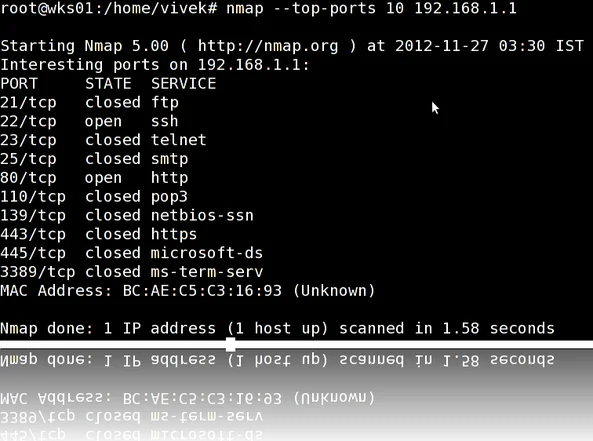

# Local Network Port Scanning Using Nmap

## Task

**Scan Your Local Network for Open Ports**

---

## Objective

The objective of this task is to discover open ports and active devices within a local network using Nmap. This helps in understanding network exposure, identifying running services, and analyzing potential security risks.

---

# Lab Environment

| Component | Details |
|---|---|
| Operating System | Kali Linux |
| Scanning Tool | Nmap |
| Nmap Version | 7.98 |
| Scan Type | TCP SYN Scan |
| Network Range | 192.168.1.0/24 |
| Wireshark Analysis | Not Performed |
| Report Type | GitHub Portfolio |

---

# Tools Required

- Kali Linux
- Nmap

---

# Prerequisites

Before performing the scan:

1. Install Nmap from the official website.
2. Identify the local network IP range.
3. Ensure you have authorization to scan the network.
4. Use security tools only in your own lab or authorized environments.

---

# Network Discovery Methodology

A TCP SYN scan was performed to identify active hosts and discover open TCP ports available within the local network.

### Command Used

```bash
nmap -sS 192.168.1.0/24
````

### Scan Explanation

| Option           | Description                |
| ---------------- | -------------------------- |
| `nmap`           | Network scanning tool      |
| `-sS`            | TCP SYN stealth scan       |
| `192.168.1.0/24` | Target local network range |

---

# Scan Execution

The scan was executed from Kali Linux against the local network.

### Scan Result Summary

```
Nmap done: 256 IP addresses (7 hosts up) scanned
```

The scan successfully identified active devices and their exposed services.

---

# Discovered Hosts and Open Ports

| Host Name                   | Masked IP Address | Open Ports    | Services         | Vendor                        |
| --------------------------- | ----------------- | ------------- | ---------------- | ----------------------------- |
| Router                      | 192.168.1.xxx     | 53, 80, 443   | DNS, HTTP, HTTPS | Zyxel Communications          |
| Network Device              | 192.168.1.xxx     | 80, 82, 554   | HTTP, Xfer, RTSP | Zhejiang Uniview Technologies |
| Mobile Device (POCO X3 Pro) | 192.168.1.xxx     | Filtered: 7   | Echo             | Unknown                       |
| Network Device              | 192.168.1.xxx     | No Open Ports | Filtered         | TP-Link Limited               |
| Unknown Host                | 192.168.1.xxx     | No Open Ports | Closed           | Unknown                       |
| System Host                 | 192.168.1.xxx     | No Open Ports | Filtered         | AzureWave Technology          |
| Local Machine               | 192.168.1.xxx     | No Open Ports | Filtered         | Unknown                       |

---

# Port and Service Analysis

## Port 53 - DNS

### Service

Domain Name System

### Purpose

DNS translates domain names into IP addresses and helps devices communicate over networks.

### Security Risks

* DNS misconfiguration may expose internal information.
* Open DNS services can become targets for abuse.
* Unauthorized DNS access may lead to DNS spoofing attacks.

---

## Port 80 - HTTP

### Service

Hypertext Transfer Protocol

### Purpose

Provides web-based access and device management interfaces.

### Security Risks

* Data transmission is not encrypted.
* Weak authentication may allow unauthorized access.
* Outdated web services may contain vulnerabilities.

---

## Port 443 - HTTPS

### Service

Hypertext Transfer Protocol Secure

### Purpose

Provides encrypted communication through SSL/TLS.

### Security Risks

* Weak SSL/TLS configurations.
* Expired or invalid certificates.
* Outdated web applications.

---

## Port 82 - Xfer

### Service

Alternative HTTP/Web Service Port

### Purpose

Used by some network devices for web-based administration.

### Security Risks

* Exposed management interfaces.
* Default credentials may allow unauthorized access.

---

## Port 554 - RTSP

### Service

Real Time Streaming Protocol

### Purpose

Used mainly by IP cameras and video streaming devices.

### Security Risks

* Weak passwords can expose camera feeds.
* Unauthorized users may access streaming services.
* Firmware vulnerabilities may affect security.

---

# Security Risk Assessment

| Finding               | Risk Level | Description                                             |
| --------------------- | ---------- | ------------------------------------------------------- |
| Open HTTP Service     | Medium     | Web interfaces may expose vulnerable services           |
| RTSP Service Exposure | Medium     | Camera streaming services require strong authentication |
| DNS Service Exposure  | Low        | Misconfiguration may reveal network information         |
| Filtered Ports        | Low        | Firewall filtering appears active                       |

---

# Potential Security Improvements

* Disable unnecessary open ports.
* Change default usernames and passwords.
* Update device firmware regularly.
* Restrict administrative interfaces.
* Enable firewall protection.
* Monitor network activity periodically.
* Perform regular vulnerability assessments.

---

# Scan Evidence

## Nmap Terminal Screenshot



---

# Key Learnings

* Learned how to perform local network reconnaissance.
* Identified active hosts using Nmap.
* Analyzed exposed ports and running services.
* Understood possible risks associated with open ports.
* Learned the importance of network security monitoring.

---

# Conclusion

The local network security assessment was successfully completed using Nmap TCP SYN scanning. The scan identified active devices, open ports, and running services within the network.

The assessment helped in understanding network exposure and highlighted the importance of proper configuration, authentication, and regular security testing.

---

# References

* Nmap Official Documentation
  [https://nmap.org/](https://nmap.org/)

* OWASP Security Guidelines
  [https://owasp.org/](https://owasp.org/)

```
```
